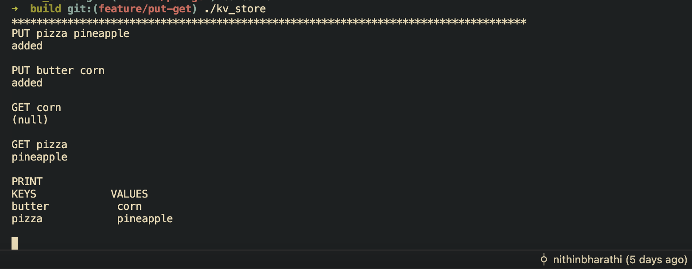

# Kv Store

A lightweight in-memory key-value store written in C with basic crash recovery and remote connection capabilities.

This project is a learning-oriented yet functional implementation of a minimal database-like system — think of it as a simplified Redis, built from scratch.

## Features
- In-memory storage for fast access
- Write-Ahead Logging (WAL) to persist changes and recover from crashes
- Event loop for serving commands from multiple remote clients over TCP without blocking
- Case-insensitive command parsing

## Installation

1. Clone the repository
```bash
git clone https://github.com/nithinbharathi/kv_store.git
```

2. Build the project
```bash
cd Kv_store
mkdir build
cd build
cmake ..
cmake --build .
```

3. Run the executable. This starts the server on port 12345
```bash
./kv_store
```

4. Open another terminal and use nc or telnet to connect to the server.
```bash
 nc localhost 12345
```

## Usage
The following operations (case insensitive) are supported:
```
- put key value - store a key value pair
- get key - retrieve the value for a given key
- print - Display all stored key value pairs
```
<br>



## Implementation details

### In-Memory hash table
- Extremely fast lookups but collisions are unavoidable. Chaining was chosen for hash collision resolution after evaluating various alternatives (linear/quadratic probing, Robin Hood hashing, cuckoo hashing). While other methods can offer faster lookups, chaining provides the best balance of simplicity, predictable performance across all operations, and ease of debugging.

- **Hash Function Choice**: DJB2 was chosen for its simplicity, good distribution for small workloads and seemingly random outputs for varied inputs. More robust non-cryptographic hash functions such as MurmurHash, FarmHash, or CityHash provide better distribution and lower collision probability on large datasets. These are planned for future integration to improve scalability and uniformity in key distribution.

### Write-Ahead logging (WAL)
- Every modifying command (PUT) is first appended to a log file before updating the in-memory table.
- fsync system call is used to ensure data is physically written to disk, not just sitting in the OS cache.
- Replaying the commands in the log will help to restore the exact state before a failure
- However, the downside is that the log grows indefinitely. Periodic snapshotting is planned for future implementation to compact the log.

### Event Loop
- Chose a single threaded non-blocking event loop to handle multiple client connections without the complexity of having to manage multiple threads.
- Reduces compute load - small, simple, and efficient for a lightweight store.
- Uses TCP sockets for reliable communication.
